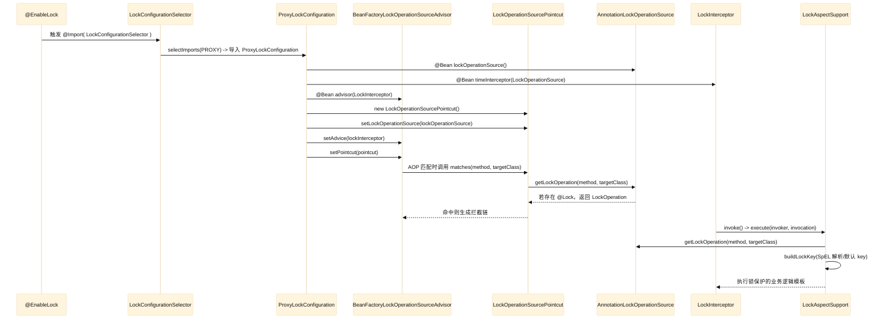
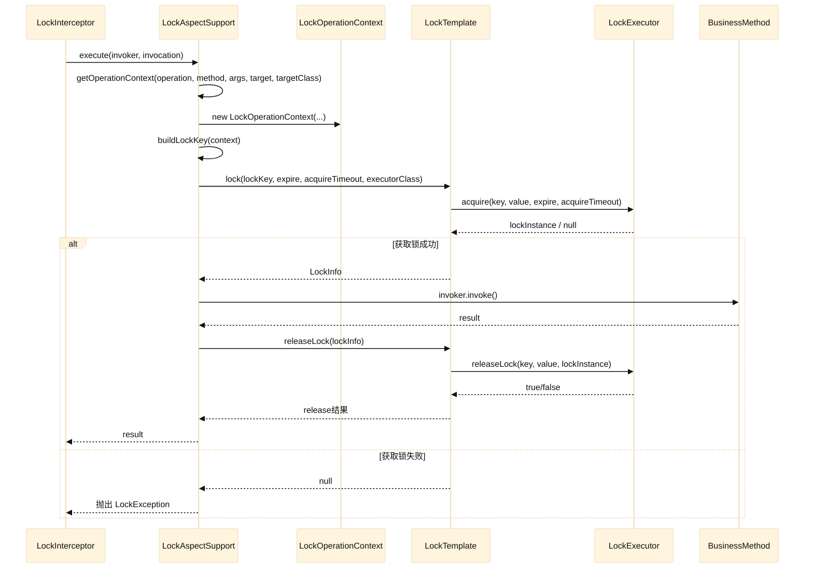

基于 `Spring AOP` 的分布式锁实现原理

---

### 目的

设计一个轻量、可扩展的分布式锁框架，统一多种锁实现，并与 Spring AOP 和 Spring Boot 自动配置无缝集成。

### 预支持方案

- `Redisson`（已实现）
- `RedisTemplate`（规划中）
- `Zookeeper`（规划中）

### 设计思路

1. 抽象锁操作元数据与执行流程
2. 通过 AOP 拦截注解方法，将锁逻辑织入业务调用
3. 通过 `LockExecutor` 扩展不同的锁实现
4. 通过 `spring-boot-starter` 实现自动装配与配置化

---

### 分布式锁设计

#### 源码实现

https://gitee.com/bkhech/RuoYi-Vue-Plus/tree/bkhech-5.X/ruoyi-common/my-common-project/src/main/java/org/dromara/common/project/lock

#### 核心 `API` 与职责

- `@Lock`：声明式锁注解，描述锁名、键、超时、执行器等
- `LockAnnotationParser`：解析锁（`@Lock`）注解为 `LockOperation` 元数据
- `LockOperation`：锁操作元数据（key、expire、`acquireTimeout`、executor），即存储分布式锁注解（`@Lock`）的配置信息
- `LockOperationSource`：数据源操作，获取目标方法的 `LockOperation`
- `LockTemplate`：模板方法，统一加锁、重试、释放的执行流程
- `LockExecutor`：底层锁执行器接口，抽象具体实现（`Redisson/Redis`等）

#### 集成到 Spring 中，以及数据解析

1. `@EnableLock` 开启锁 `AOP` 模块
2. `@Lock` 标注在方法上，声明锁语义
3. `SpringLockAnnotationParser` 解析（`@Lock`）注解为 `LockOperation`
4. `AnnotationLockOperationSource` 缓存并提供 `LockOperation`

#### 锁键生成规则（当前实现）

1. 注解解析阶段
- 前缀：`lock.lock-key-prefix`
- 名称：`@Lock(name)` 优先，否则为 `类名 + 方法名`
- 拼接：`<prefix>:<name>#<key>`
2. 执行阶段
- `LockTemplate` 会再加一层全局 Redis 前缀：`GlobalConstants.GLOBAL_REDIS_KEY`

最终 key 结构示意：

```ini
GlobalConstants.GLOBAL_REDIS_KEY : lock.lock-key-prefix : name # key
```

说明：

- `@Lock.key` 支持 SpEL 表达式，执行阶段解析。
- 如果业务方未设置 `@Lock.name`，则默认 `类全名 + 方法名`。
- 如果 `@Lock.key` 为空，则默认使用方法参数拼接生成 key。

#### SpEL 解析说明

1. 解析时机
- 在 AOP 执行阶段解析（`LockAspectSupport`），确保拿到真实运行时参数。
2. 可用上下文变量
- `#root.method`：当前方法
- `#root.target`：目标对象
- `#root.targetClass`：目标类
- `#root.methodName`：方法名
- `#root.args`：参数数组
- 参数引用：`#p0`、`#a0`，或参数名（若可获取）
3. 解析规则
- 含 `#` 或 `T(...)` 的表达式视为 SpEL
- 解析结果使用 `nullSafeToString` 作为 key 片段
4. 示例
- `@Lock(name = "order", key = "#orderId")`
- `@Lock(name = "order", key = "#user.id + ':' + #orderId")`
- `@Lock(name = "pay", key = "T(java.util.Objects).hash(#req)")`

#### 架构关系

```ini
@Lock → LockOperationSource → LockInterceptor → LockAspectSupport → LockTemplate → LockExecutor
```

执行步骤：

1. `LockOperationSourcePointcut` 判断目标方法是否存在锁元数据
2. `BeanFactoryLockOperationSourceAdvisor` 将 `LockInterceptor` 织入调用链
3. `LockInterceptor` 包装业务方法为 `LockOperationInvoker`
4. `LockAspectSupport` 统一执行
- 解析锁元数据
- 通过 `LockTemplate` 加锁
- 执行业务逻辑
- 释放锁

注意：

- 代理模式下，同类内部调用不会触发 AOP 拦截。
- `LockOperationContext` 会缓存方法元数据与参数信息，避免重复创建。

#### Spring AOP 集成

1. `LockOperationSourcePointcut` 负责方法匹配
2. `BeanFactoryLockOperationSourceAdvisor` 负责织入通知
3. `LockInterceptor` 将业务方法包装为 `LockOperationInvoker`
4. `LockAspectSupport` 作为模板执行锁逻辑

#### LockTemplate 核心流程

1. 选择执行器
- `@Lock.executor` 指定优先
- 未指定则使用 `lock.primary-executor` 或容器中第一个注入的执行器（依赖 Spring 注入顺序）
2. 计算超时与重试
- 未设置 `expire` 时使用 `lock.expire`
- 未设置 `acquireTimeout` 时使用 `lock.acquire-timeout`
- 重试间隔为 `lock.retry-interval`
3. 执行加锁
- 循环尝试直到超时或获取成功
4. 释放锁
- 调用 `LockExecutor.releaseLock`，需要校验 `lockValue`

#### LockExecutor 约定

接口能力：

- `acquire(key, value, expire, acquireTimeout)`：获取锁
- `releaseLock(key, value, lockInstance)`：释放锁
- `renewal()`：是否支持锁续期（当前仅 Redisson 支持，且 `expire = -1` 才触发）

解锁时校验 `lockValue` 的原因：

- 防止锁过期后，被其他线程重新获得锁而误解锁。

#### Redisson 实现

- `RedissonLockExecutor` 基于 `RLock.tryLock` 实现
- 获取锁成功返回 `RLock`，失败返回 `null`
- 解锁时判断 `isHeldByCurrentThread`

注意：

- `RedissonLockAutoConfiguration` 上当前标注的是 `@ConditionalOnMissingBean(RedissonClient)`。
- 该配置类内部仍依赖 `RedissonClient` Bean，实际使用时需确保容器中存在 `RedissonClient`。

#### Spring Boot 自动配置

自动配置入口：

- `LockAutoConfiguration`
- 通过 `spring.factories`/`AutoConfiguration.imports` 发现

自动配置内容：

- 绑定配置属性 `LockProperties`
- 收集所有 `LockExecutor` 实现
- 创建 `LockTemplate`

#### 配置项说明

```yaml
lock:
  enabled: true                # 全局开关
  expire: 30000                # 默认过期时间(ms)
  acquire-timeout: 3000        # 获取锁超时时间(ms)
  retry-interval: 100          # 重试间隔(ms)
  lock-key-prefix: "lock"      # 业务锁前缀
  primary-executor: ""         # 默认执行器类名（可选）
```

约束规则（代码内校验）：

- `expire > acquireTimeout`
- `lock-key-prefix` 不能为空，长度不超过 100
- `retry-interval >= 0`

#### 典型使用示例

```java
@Configuration
@EnableLock
public class LockConfig {}

@Service
public class OrderService {

    @Lock(name = "orderLock", key = "#orderId", expire = 10000, acquireTimeout = 2000)
    public void createOrder(String orderId) {
        // 业务逻辑
    }
}
```

#### 扩展点

- 自定义 `LockExecutor` 实现新的锁类型
- 自定义 `LockAnnotationParser` 以支持 SpEL 或自定义 key 规则
- 自定义 `LockOperationSource` 支持非注解驱动的锁元数据来源

---

#### AOP 织入链路时序图

> 按类名组织
> 在线查看，请访问：https://www.processon.com/view/link/698d9401083ab93f397d7b36 访问密码：22AL

下面按“从 `@EnableLock` 到 `LockAspectSupport`”的执行路径，使用时序图描述 AOP 织入链路与关键调用点。



 **说明（类名 -> 关键职责）**

- `EnableLock`：通过 `@Import(LockConfigurationSelector)` 触发 AOP 基础设施加载。
- `LockConfigurationSelector`：根据 `AdviceMode.PROXY` 选择 `ProxyLockConfiguration`。
- `ProxyLockConfiguration`：注册 `LockInterceptor`、`LockOperationSource`、`Advisor`、`Pointcut`。
- `BeanFactoryLockOperationSourceAdvisor`：将 `LockInterceptor` 织入 Spring AOP。
- `LockOperationSourcePointcut`：在方法匹配阶段调用 `LockOperationSource#getLockOperation`。
- `AnnotationLockOperationSource`：解析 `@Lock` 并缓存 `LockOperation`。
- `LockInterceptor`：将业务调用包装为 `LockOperationInvoker`，委托 `LockAspectSupport`。
- `LockAspectSupport`：核心执行模板，解析锁 key 并驱动锁流程。

---

#### 拦截后到加锁、解锁时序图

> 按类名组织
>
> 在线查看，请访问：https://www.processon.com/view/link/698d96d9083ab93f397d7f58 访问密码：1DN7

下面描述从 `LockInterceptor.invoke(...)` 开始，到 `LockTemplate` 获取锁、执行业务、释放锁的完整路径。



 **说明（类名 -> 关键职责）**

- `LockInterceptor`：拦截方法调用，包装为 `LockOperationInvoker` 交给模板执行。
- `LockAspectSupport`：构建 `LockOperationContext`、解析 key、负责 try/finally 释放锁。
- `LockOperationContext`：缓存方法元数据与参数，支持 SpEL 解析上下文。
- `LockTemplate`：统一加锁/重试/释放流程，选择 `LockExecutor`。
- `LockExecutor`：真正执行底层加锁/解锁（如 Redisson）。
- `BusinessMethod`：被 `@Lock` 标记的业务方法本体。

- 

#### 当前限制与待完善

- [x] `@Lock.key` 的 SpEL 解析已实现（AOP 执行阶段解析）
- [ ] 失败获取锁会抛出 `LockException`，暂无默认重试策略以外的降级方案
- [ ] @Lock 属性 key 支持数组
