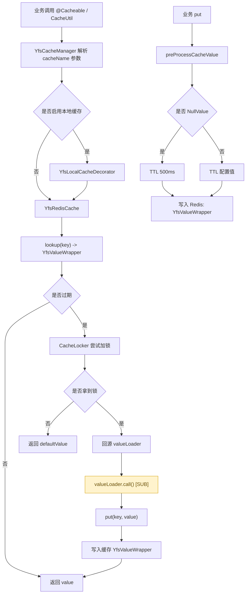
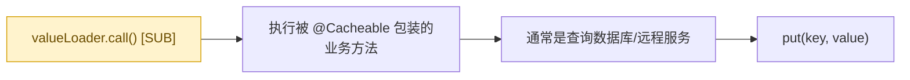

# Spring Cache 扩展说明

本文档总结 `yfs-dy-core/src/main/java/com/yunyang/dy/core/framework/cache` 包下基于 Spring Cache 的扩展设计与实现，目标是解释整体设计思想、关键组件职责、数据流与配置方式，便于维护与二次演进。

## 范围说明  
覆盖以下包路径：
`yfs-dy-core/src/main/java/com/yunyang/dy/core/framework/cache`
`yfs-dy-core/src/main/java/com/yunyang/dy/core/framework/cache/config`
`yfs-dy-core/src/main/java/com/yunyang/dy/core/framework/cache/core`

---

## 设计思想

1. 兼容 Spring Cache 标准 API  
实现自定义 `CacheManager` 和 `Cache`，保证业务仍可用标准 `@Cacheable`/`@CachePut`/`@CacheEvict`。

2. 支持“缓存击穿”保护  
通过 `YfsValueWrapper` 记录过期时间，过期后由互斥锁保证仅一个线程回源加载，避免并发击穿。

3. 支持本地一级缓存（Caffeine）  
`YfsLocalCacheDecorator` 以装饰器方式把 Caffeine 作为本地 L1，降低对 Redis 访问压力。

4. 业务可控的 TTL 与缓存参数  
通过在 `@Cacheable` 的 `cacheNames`/`value` 上引入 `key#ttl#localCache` 格式，实现单个缓存维度 TTL/本地缓存开关的配置。

5. 可控的序列化策略  
通过统一 `ObjectMapper` 配置，结合 `GenericJackson2JsonRedisSerializer`，保证复杂对象、`LocalDateTime`、`NullValue` 等序列化兼容。

---

## 整体流程

### 流程概述

1. 业务调用缓存  
业务使用 `@Cacheable` 或 `CacheUtil` 访问缓存。

2. CacheManager 分发  
`YfsCacheManager` 解析缓存名（例如 `user#5m#true`），构建 `YfsRedisCache`（可选装饰本地缓存）。

3. Cache 读写  
`YfsRedisCache` 读取 Redis 中的 `YfsValueWrapper`，判断是否过期，过期则进入锁保护逻辑。

4. 锁保护回源  
`CacheLocker` 通过 Redis 的 `SETNX + EXPIRE` 实现互斥锁，确保并发只有一个线程加载数据。

5. 写回缓存  
写入时统一封装为 `YfsValueWrapper(expiredAt, value)`，并按 TTL 计算过期时间。

---

### 流程图（读写与击穿保护）



---

`**valueLoader 子流程 [SUB] **`



---

## 核心组件与职责

**1. 配置与条件开关**

- `CacheProperties`  
路径：`.../config/CacheProperties.java`  
统一缓存配置，支持：
  - `yfs.cache.enabled` 是否启用缓存扩展  
  - `yfs.cache.timeToLive` 全局默认 TTL  
  - `yfs.cache.cacheNullValues` 是否允许缓存 null（当为 `false` 时会调用 `disableCachingNullValues()`）  
  - `yfs.cache.keyPrefix` 缓存 key 前缀  
  - `yfs.cache.useKeyPrefix` 是否使用前缀  
  - `yfs.cache.localCache.spec` Caffeine 本地缓存配置

- `CacheCondition`  
路径：`.../core/CacheCondition.java`  
只有 `yfs.cache.enabled=true` 且存在 `RedisConnectionFactory` 时才启用缓存配置。

- `YfsCacheConfiguration`  
  路径：`.../config/YfsCacheConfiguration.java`  
  作用：
  - 启用 `@EnableCaching`
  - 配置 Caffeine（本地缓存）
  - 构建 `YfsCacheManager`
  - 注册 `CacheLocker`
  - 配置 `ObjectMapper` 和 Redis 序列化

**序列化细节**

`objectMapper()` 的关键点：
1. 注册 `JavaTimeModule` 并指定 `LocalDateTime` 序列化格式  
2. 为 `NullValue` 添加混入 `NullValueMixin` 以支持类型信息  
3. `FAIL_ON_EMPTY_BEANS=true`，保证空对象不能被误序列化  
4. 默认启用类型信息 `DefaultTyping.NON_FINAL`

---

**2. 缓存管理器与缓存实例**

- `YfsCacheManager`  
路径：`.../core/YfsCacheManager.java`  
作用：
1. 解析 `cacheName` 中的扩展参数  
2. 按需创建 `YfsRedisCache`  
3. 可选装饰 `YfsLocalCacheDecorator`  
4. 可选支持 `TransactionAwareCacheDecorator`

**缓存名格式**

`cacheName#ttl#local` 示例：  
- `user#5m#true`  
  - `cacheName = user`  
  - `ttl = 5m`  
  - `localCache = true`

**默认逻辑**

- TTL 无效时回退到 `DEFAULT_TTL`（20 分钟）  
- `localCache` 未指定时默认 `false`

---

**3. 具体缓存实现**

- `YfsRedisCache`  
路径：`.../core/YfsRedisCache.java`  
基于 `RedisCache` 的增强实现：
1. 读取时将 Redis 值解析为 `YfsValueWrapper`  
2. 判断是否过期，过期进入锁保护回源  
3. 写入时统一封装 `YfsValueWrapper`  
4. 为 NullValue 设置极短 TTL（默认 500ms）防止缓存穿透  

**缓存击穿保护机制**

核心逻辑在 `get(Object key, Callable<T> valueLoader)` 中：
- 如果缓存过期，进入 `valueFromLoader`  
- `valueFromLoader` 使用 `CacheLocker` 加锁  
- 拿到锁的线程执行 `valueLoader.call()`  
- 未拿到锁的线程返回默认值（避免并发回源）

**Null 值处理**

`YfsRedisCache` 使用 Spring 的 `NullValue` 标记空值（前提是允许缓存空值）：
- `preProcessCacheValue` 把 `null` 转换为 `NullValue`  
- `fromStoreValue` 将 `NullValue` 还原为 `null`

短 TTL 防止缓存穿透，避免空值长时间占用缓存。

---

**4. 本地缓存装饰**

- `YfsLocalCacheDecorator`  
路径：`.../core/YfsLocalCacheDecorator.java`  
核心特性：
1. 使用 Caffeine 缓存 `Cache.ValueWrapper`  
2. 缓存 key = `cacheName:key`  
3. `put/putIfAbsent/evict` 时清理本地缓存，保证一致性

本地缓存是可选的，只有 `cacheName` 参数中启用才会装饰。

---

**5. 过期包装器**

- `YfsValueWrapper`  
路径：`.../core/YfsValueWrapper.java`  
作用：
1. 包装 `value` 与 `expiredAt`  
2. `isExpired()` 用于判断是否过期  
3. `expiredAt` 由 `YfsRedisCache` 写入时计算

该类是缓存击穿保护的关键：通过把“过期判断”放到业务侧，而不是完全依赖 Redis TTL。

---

**6. 分布式锁**

- `CacheLocker`  
路径：`.../core/CacheLocker.java`  
机制：
1. 通过 `StringRedisTemplate` 调用 `setIfAbsent`（SETNX）  
2. 自带超时（默认 2 秒）避免死锁  
3. 锁 key 格式：`<key>:lock`

用于缓存击穿场景下的并发保护。

---

**7. 工具类**

- `CacheUtil`  
路径：`.../CacheUtil.java`  
基于 `YfsCacheManager` 的静态工具类，提供 `get/put/evict/clear` 操作。

- `RedisUtils`  
路径：`.../RedisUtils.java`  
扩展的 Redis 工具类，支持：
  - 基本 `get/set/expire/delete`  
  - `setIfAbsent/setIfPresent`  
  - Redisson 全局限流 `rateLimiter`

- `CacheId`  
路径：`.../CacheId.java`  
接口约定，提供 `getCacheId()` 用于生成业务缓存 key。

---

## 关键设计点总结

1. `YfsCacheManager` 解析缓存名参数，把“配置”放到注解中  
2. `YfsValueWrapper` 把过期时间内嵌在缓存值中，避免 Redis TTL 直接触发击穿  
3. `CacheLocker` 保障回源互斥  
4. 本地缓存通过装饰器实现，不侵入业务  
5. 序列化配置集中在 `YfsCacheConfiguration`，避免散落配置不一致

---

## 适用场景

- 访问频繁、读多写少的缓存场景  
- 需要快速定位缓存 TTL 并支持“按缓存名配置”的项目  
- 需要 Redis + 本地缓存联合的场景  
- 需要避免缓存击穿的热点场景

---

## Spring cache 拓展注意点

1. 如果 `yfs.cache.enabled=false`，本扩展不会生效  
2. 缓存名参数格式必须遵循 `name#ttl#local`，否则解析失败  
3. 使用本地缓存时，需注意一致性（写操作已做本地失效）  
4. `NullValue` 依赖 `ObjectMapper` 的混入注解与默认类型信息

---

## `Redis` 相关问题

### `Redis` 常见问题与解决方案
> 结合本项目实现

**一、问题分类详解**

**1. 缓存穿透**  
**问题描述：** 请求的数据（单个key）在缓存与数据库中都不存在，导致每次请求都直接打到数据库。  
**典型场景：** 非法参数/恶意请求频繁访问不存在的 ID；业务侧对参数未做校验。  
**表现特征：** DB QPS 持续升高但命中率低；缓存命中率异常偏低。  
**危害：** 数据库压力飙升、响应延迟升高，严重时可能导致服务雪崩。  
**解决方案：**  

1. 缓存空值（短 TTL）防止重复穿透。  
   对应实现：`yfs-dy-core/src/main/java/com/yunyang/dy/core/framework/cache/core/YfsRedisCache.java`（`nullValueTtl` + `preProcessCacheValue`）。  
2. 使用布隆过滤器或白名单校验，提前拦截非法/不存在的 key。  
3. 限流或熔断对异常流量进行保护。  

**2. 缓存击穿**  
**问题描述：** （单个）热点 key 过期瞬间大量并发请求打到数据库。  
**典型场景：** 热点商品/用户信息缓存到期；流量峰值集中。  
**表现特征：** 某个时间点 DB QPS 突增；热点 key 的访问延迟飙升。  
**危害：** 瞬时高峰导致数据库超载，服务响应明显变慢。  
**解决方案：**  
1. 通过互斥锁/分布式锁控制回源并发（本项目 `CacheLocker`）。  
   对应实现：`yfs-dy-core/src/main/java/com/yunyang/dy/core/framework/cache/core/CacheLocker.java` + `YfsRedisCache.valueFromLoader()`。  
2. 逻辑过期 + 后台异步重建（本项目通过 `YfsValueWrapper` 判断过期）。  
   对应实现：`yfs-dy-core/src/main/java/com/yunyang/dy/core/framework/cache/core/YfsValueWrapper.java` + `YfsRedisCache.get(...)`。  
3. 提前刷新/延迟失效（在过期前异步刷新缓存）。  

**3. 缓存雪崩**  
**问题描述：** 大量 key 在同一时刻过期，引发数据库瞬时高峰。  
**典型场景：** 批量预热后 TTL 设置一致；大促场景同一时刻失效。  
**表现特征：** 多个业务接口同时响应变慢；DB 负载在短时间内整体升高。  
**危害：** 服务整体不稳定甚至不可用。  
**解决方案：**  

1. TTL 加随机抖动，避免同一时刻集中失效。  
   对应落点：在业务 `@Cacheable` 的 `cacheNames` 参数中配置不同 TTL（例如 `xxx#10m#true`、`xxx#12m#true`），或在 `YfsCacheManager.getMissingCache()` 处做随机抖动（项目现未实现）。  
2. 分批预热缓存或分级缓存策略。  
   对应落点：可在业务启动后按模块分批加载（例如 `CommandLineRunner` 或 `ApplicationRunner`），或者在服务层提供批量预热方法。  
3. 核心接口降级/限流，保护数据库。  
   对应落点：可结合 `RedisUtils.rateLimiter(...)` 做全局限流。  

**4. 数据不一致**  
**问题描述：** 数据库更新后，缓存仍然是旧值。  
**典型场景：** 先更新缓存再更新数据库；并发写入时缓存未及时失效。  
**表现特征：** 用户看到旧数据；缓存与 DB 数据对不上。  
**危害：** 业务逻辑错误、用户体验受损，严重时引发交易或数据错误。  
**解决方案：**  
1. 更新数据库后主动删除缓存（推荐“先写库再删缓存”）（Cache-Aside 模式）。  
   对应落点：在业务写操作完成后调用 `CacheUtil.evict(...)` 或直接调用 `CacheManager` 的 `evict`。  
2. 对重要数据引入消息队列异步更新缓存。  
   对应落点：建议在业务层订阅更新事件/消息，触发缓存更新或删除。  
3. 缓存加 TTL，保证最终一致性。  
   对应落点：`CacheProperties.timeToLive` 全局 TTL 与 `cacheNames#ttl` 单独 TTL。  

**5. 缓存预热**  
**问题描述：** 服务刚启动或重启后缓存为空，短时间内大量请求会集中打到数据库。  
**典型场景：** 发布重启、缓存集群故障恢复、业务大促前冷启动。  
**表现特征：** 启动初期数据库 QPS 飙升、热点接口响应变慢。  
**危害：** 冷启动期间易触发数据库瓶颈，影响整体可用性。  
**解决方案：**  

1. 启动阶段主动加载热点数据到缓存（定时任务/启动监听器/手动触发）。  
   对应落点：可新增 `ApplicationRunner`/`CommandLineRunner`，在启动时调用业务 Service 的批量加载方法并写入缓存。  
2. 结合业务场景做分批预热，避免瞬时高负载。  
   对应落点：在业务 Service 层拆分批次写入缓存，控制并发/速率。  
3. 预热与限流配合，保护后端数据库。  
   对应落点：结合 `RedisUtils.rateLimiter(...)` 或网关层限流策略。  

**7. 热 Key 问题**  
**问题描述：** 少数几个 key 被高频（QPS）访问，导致单点压力过高，甚至触发 Redis 热点瓶颈。  
**典型场景：** 首页/榜单/配置类 key 集中访问；单 key 承载高并发。  
**表现特征：** 单个 key QPS 极高；Redis 热点告警或单节点抖动。  
**危害：** 单点瓶颈导致整体响应抖动，影响稳定性。  
**解决方案：**  

1. 局部拆分（即 key 分片，例如按维度分片）。  
2. 增加本地缓存（Caffeine）分担 Redis 压力 ，和多级缓存（削峰） 。  
   对应实现：`yfs-dy-core/src/main/java/com/yunyang/dy/core/framework/cache/core/YfsLocalCacheDecorator.java`。
3. 读写分离策略 。
4. 请求合并（批量查询代替多次查询） 。
5. 对热点 key 进行分布式限流或降级。 

**8. 大 Key 问题**  
**问题描述：** 单个 key 的 value 过大或结构过深，导致序列化/网络/内存开销显著上升。  
**典型场景：** 将大列表/明细一次性缓存；缓存对象字段过多且冗余。  
**表现特征：** Redis 慢查询增多；网络带宽异常升高；反序列化耗时明显。  
**危害：** Redis 性能下降、接口响应变慢，严重时影响整体稳定性。  
**解决方案：**  
1. 拆分 key（按分页/维度分片）或拆结构，避免单值过大。  
2. 压缩或裁剪字段，只缓存必要字段。  
3. 设置合理 TTL，避免大对象长期占用内存。  

**9. 内存泄漏**  
**问题描述：** 缓存条目持续增长或未按预期过期，导致 Redis 或本地缓存内存长期上涨。  
**典型场景：** 未设置 TTL；key 空间无限增长；本地缓存未限制容量。  
**表现特征：** Redis 内存持续上涨不回落；JVM 堆占用不断增长。  
**危害：** Redis OOM 或 JVM OOM，导致服务不可用。  
**解决方案：**  
1. 确保所有缓存设置合理 TTL，避免永久缓存。  
   对应落点：`CacheProperties.timeToLive` 全局 TTL 与 `cacheNames#ttl` 单独 TTL。  
2. 本地缓存设置容量与过期策略，避免无限增长。  
   对应落点：`yfs.cache.localCache.spec`（Caffeine 配置）。  
3. 定期清理冷数据或设置淘汰策略，避免长时间无访问数据占用空间。  

**二、对比总结**

| 问题 | 根本原因 | 影响范围 | 解决方案 |
| --- | --- | --- | --- |
| 缓存穿透 | 不存在的数据被频繁请求，缓存与 DB 都没有命中 | 数据库压力飙升，接口响应变慢，单个key | 缓存空值（短 TTL）；布隆过滤器； |
| 缓存击穿 | 热点 key 过期瞬间并发回源 | 某热点接口抖动、DB 瞬时过载，单个热点key | 互斥锁/分布式锁；逻辑过期 |
| 缓存雪崩 | 大量 key 同时过期或缓存大面积失效 | 多接口同时变慢、整体服务不稳定，大量key | TTL 随机抖动；分批预热；降级/限流 |
| 数据不一致 | 写库与缓存更新顺序不当或未同步 | 业务数据错误、用户体验差 | 写库后删缓存（Cache-Aside 模式）；异步消息更新；TTL 最终一致 |
| 缓存预热 | 冷启动时缓存为空 | 启动阶段 DB 压力大、接口变慢 | 启动预热；分批加载；限流保护 |
| 热 Key 问题 | 单个 key 访问量过高 | Redis 热点瓶颈、局部抖动 | key 分片/复制；多级缓存；限流/降级 |
| 大 Key 问题 | 单个 key 值过大或结构过深 | Redis 内存/网络/序列化开销上升 | 拆分 key；压缩/裁剪字段；合理 TTL |
| 内存泄漏 | 无 TTL/无限 key 增长/本地缓存无上限 | Redis/JVM OOM，服务不可用 | 全量 TTL；限制本地缓存容量；淘汰策略 |

**三、Redis 最佳实践建议**

1. 架构层：多级缓存（本地 + Redis）、读写分离、集群部署以提升可用性与扩展性。  
2. 数据模型层：统一 key 前缀与命名规范；控制 value 大小（拆分/裁剪字段）避免大 key。  
3. 缓存策略层：所有缓存必须设置 TTL；热点数据优先本地缓存；关键写操作遵循“先写库再删缓存”。  
4. 保护机制层：热点接口增加限流/熔断；必要时引入异步更新与重试机制。  
5. 容量与淘汰层：提前规划容量，配置合理的淘汰策略与过期策略。  
6. 监控与运维层：监控命中率、延迟、内存、QPS、慢查询；定期清理无用 key。  

---

### `Redis` 热点瓶颈

`Redis` 热点瓶颈（`Hotspot Problem`） 是指系统中某些特定的 key 或数据分片接收到的访问请求远高于其他数据，导致 `Redis` 单实例或单分片负载过高，成为系统性能瓶颈的现象。

**一、热点瓶颈的两种主要形式**

1. 热 Key（Hot Key）

- 定义：少数几个 key 的访问量（`QPS`）远超其他 key
- 典型场景：

  - 明星/网红的个人主页
- 热门新闻/热搜话题
  - 电商平台的秒杀商品
- 系统配置项

2. 热分片（`Hot Slot`）

- 在使用 `Redis Cluster` 时，某些 slot 上的数据访问量过大，即使单个 key 不热，但多个热 key 恰好在同一分片

**二、热点瓶颈的表现特征**

- 网络流量不均：某节点网络 I/O 远高于其他节点
- CPU 使用率高：单实例 CPU 持续高负载
- 响应时间增加：特定操作变慢，甚至超时
- 连接数激增：大量客户端连接到同一节点
- 监控指标异常：
  - keyspace_hits 集中在特定 key；
  - 慢查询日志中频繁出现相同 key；
  - QPS 分布极不均衡


**三、热点瓶颈的危害**

1. 性能层面
- 单点瓶颈：整个集群的性能受限于单节点上限
- 延迟增加：客户端请求排队等待
- 资源浪费：集群中其他节点负载很低

2. 稳定性层面
- 服务雪崩：热 key 所在节点宕机引发连锁反应
- 数据丢失风险：主节点压力过大，同步延迟
- 扩缩容失效：增加节点无法缓解热点问题

**四、产生热点的常见场景**

1. 业务设计层面
- 全局计数器
- 排行榜第一名等单 key 高并发

```python
# 反例1：全局计数器
INCR global_counter  # 所有用户都操作同一个 key

# 反例2：排行榜第一名的数据
GET top_user_profile  # 频繁访问同一数据
```
2. 数据分布问题

- 哈希分片时，某些业务数据天然聚集

- 时间序列数据集中在最新时间点

3. 突发事件

- 突发新闻/热搜

- 营销活动秒杀

- 系统故障时的重试风暴

**五、解决方案**

层级一：应用层处理
1. 本地缓存（最有效），本地缓存（短过期时间）与互斥锁避免击穿
```java
// 使用本地缓存 + 短过期时间
public String getHotData(String key) {
    // 1. 先查本地缓存
    String value = localCache.get(key);
    if (value != null) return value;
   
    // 2. 本地没有，查 Redis（使用互斥锁避免缓存击穿）
    synchronized(key.intern()) {
        value = localCache.get(key);
        if (value == null) {
            value = redis.get(key);
            if (value != null) {
                // 设置短的本地缓存时间（如 1-3 秒）
                localCache.put(key, value, 3);
            }
        }
    }
    return value;
}
```
2. 请求合并（MGET）
```python
# 批量查询代替多次查询
# 反例：for user_id in user_ids: get user:{user_id}
# 正例：使用 MGET 批量获取
```
3. 互斥锁

层级二：数据层（Redis ）

3. Key 分片（Sharding）
```python
# 将热 key 拆分成多个子 key
def get_hot_key(key_base, user_id):
    # 根据用户ID或其他维度拆分
    shard_id = user_id % 10  # 拆成10份
    return f"{key_base}:shard_{shard_id}"
# 示例：将商品库存拆分为多个子库存
# 原key: stock:product_123
# 拆分后: stock:product_123:shard_0 ... stock:product_123:shard_9
```
4. 数据副本


- 主从架构，将读请求分散到多个从节点，但需要注意数据一致性问题

层级三：架构层
5. 读写分离
```text
写请求 → 主节点
读请求 → 多个从节点（负载均衡）
```
6. 多级缓存架构
```text
客户端 → CDN/边缘缓存 → 应用本地缓存 → Redis集群 → DB
```
7. 业务降级

- 核心数据与非核心数据分离
- 热点期间简化数据返回格式

层级四：监控与治理
8. 热点探测（`hotkeys/bigkeys/monitor`）
```bash
# Redis监控命令
redis-cli --hotkeys            # 查找热key
redis-cli --bigkeys            # 查找大key
MONITOR | grep "GET\|SET"      # 实时监控命令

# 使用代理中间件自动识别热key
# 如：Twemproxy、Codis、Redis Proxy
```
9. 动态调整

- 自动将热 key 迁移到专用实例

- 基于实时流量调整分片策略

**六、实际案例分析**

- 场景：电商秒杀
```python
# 问题：所有用户抢购同一商品，库存 key 成为热key
stock_key = "stock:product_1001"
# 解决方案：库存分片
def reduce_stock(product_id, user_id):
    # 1. 将库存拆分成10份
    shard_id = user_id % 10
    shard_key = f"stock:product_{product_id}:shard_{shard_id}"
    
    # 2. 使用 Lua 脚本保证原子性
    lua_script = """
        local stock = redis.call('GET', KEYS[1])
        if stock and tonumber(stock) > 0 then
            redis.call('DECR', KEYS[1])
            return 1
        end
        return 0
    """
    
    # 3. 用户随机或固定分配到某个分片
    return redis.eval(lua_script, 1, shard_key)
```
**七、预防措施**

- 设计阶段：
  - 评估业务访问模式
  - 避免单一 key 承载过大流量

- 开发阶段：
  - 强制使用 key 分片模式
  - 实现本地缓存机制

- 测试阶段：
  - 压力测试时模拟热点场景
  - 验证降级与限流方案有效性
- 运维阶段：
  - 建立热点监控告警
  - 制定应急预案


**八、总结**

`Redis` 热点瓶颈是**分布式缓存系统的典型挑战**，本质是**请求分布不均匀**导致的局部过载。解决思路需要**多层次综合施策**：

- 短期：本地缓存 + 请求合并
- 中期：数据分片 + 读写分离
- 长期：架构优化 + 业务改造
- 持续：监控预警 + 自动化处理

**关键在于**：在系统设计初期就考虑热点问题，而不是等问题出现后再补救。

